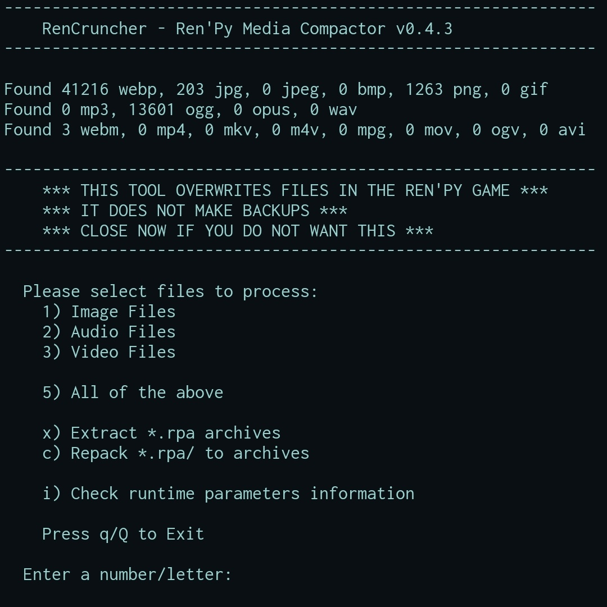
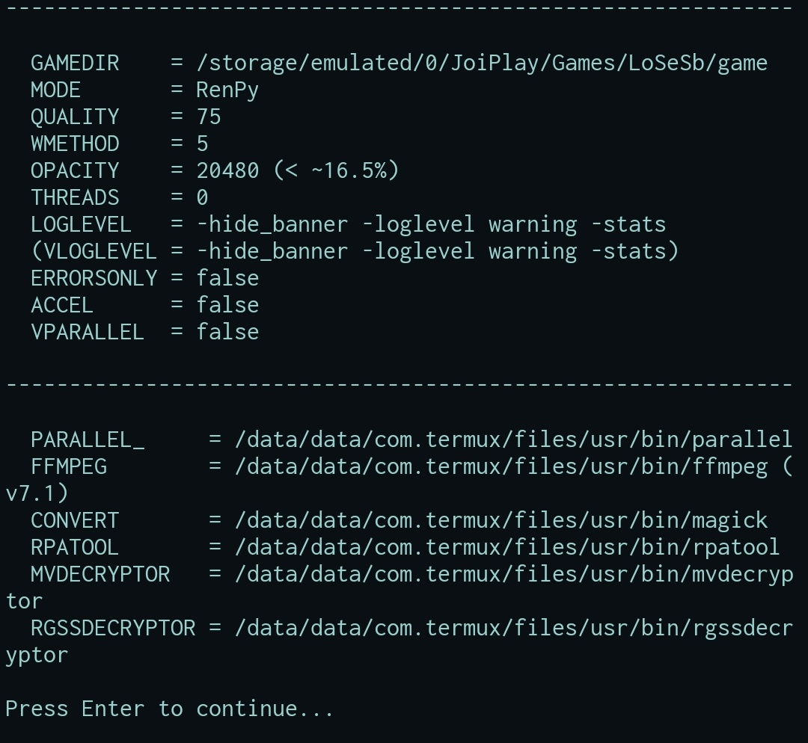

# Cruncher

A tool for compressing media files on RenPy, RPGM, and Other media like files.
Based on [Cruncher by bas][Cruncher]; essentially a Termux port with extended functionality.

* [**Dependencies**](#dependency)
* [**Features**](#features)
  + [**Screenshots (TUI)**](#screenshots-tui)
* [**Usage**](#usage)
  + [**Usage (tl;dr)**](#usage-tldr)
* Guides:
  + [**How to compress RPG Maker MZ games**](#how-to-compress-rpg-maker-mz-games)
  + [**How to unpack RPG Maker VX Ace game resources archive**](#how-to-unpack-rpg-maker-vx-ace-game-resources-archive)
  + [**How to compress RPG Maker MV games with .soldata files**](#how-to-compress-rpg-maker-mv-games-with-soldata-files)
  + [**How to compress Electron games with resources packed in an .asar file**](#how-to-compress-electron-games-with-resources-packed-in-an-asar-file)
    - [**How to create a Linux version of an Electron game**](#how-to-create-a-linux-version-of-an-electron-game)

## Dependency

```
ffmpeg
```
```
imagemagick
```
```
mono
```
```
nodejs / nodejs-lts
```
```
+ parallel (optional)
```
```
python
```
```
which
```
```
rust (for alternative tools)
```

## Features

Functionally it does the same thing as the original (Windows) script: re-encodes media files into lightweight formats
(WebP for images, ogg/mp3 for audio, WebM for video) without changing file extensions, expecting the game to accept them
quietly (which means it's unlikely to work on games that use a rigidly implemented engine).  
The parameters are based on Windows script version (except that ffmpeg thread count was changed to optimal detected).

 * Works for Ren'Py, RPGM (MV/MZ/VX Ace), and other (mainly HTML) games that support resource compression (or rather,
   detect file type by contents).
 * The main script is a standalone file which can either be dropped into the game folder or installed globally (other
   files are symlinks; see [Usage](#usage) for details).
 * Depends only on common opensource packages available (via package manager) 
   ; doesn't depend on Python ([`webp-header-fix`][webp-header-fix] was reimplemented using GNU coreutils).
 * Doesn't accidentally delete files; only replaces the file if the new version is actually smaller.
 * Allows for providing a few custom parameters (e.g. WebP compression quality or ffmpeg threads number).
 * If [parallel][parallel] is detected, it can be used for batch conversion in parallel (multicore), dramatically
   increasing processing speed.
 * There's an option to use hardware VP9 codec, which dramatically increases conversion speed of videos (also making it
   compatible with parallel mode), at the cost of slightly reduced quality. (It's looks alright for animation but its
   output for IRL videos may look rather fuzzy; and 3D renders may have blocky shadows.)
 * ~Not worked: unpacking Ren'Py archives (for this I use [rpatool][rpatool]: `rpatool -x archive.rpa`), decoding
   RPGM files (for this I found/patched [a small Python script][MvDecryptor]).~~
 * If [rpatool][rpatool] is detected, it can be used for batch unpacking/repacking of RPA archives (output folder
   replaces original archive, taking the same name including extension).
 * If [`MvDecryptor`][MvDecryptor] is detected, it can be used for batch decoding of RPGM (MV/MZ) resource files. (For
   MZ, additional adjustment is needed – [see below](#how-to-compress-rpg-maker-mz-games).)
 * See Also [Alternative tool Rpgm MV MZ][Alternative tool Rpgm MV MZ] and [Alternative tool Rpgm VX Ace][Alternative tool Rpgm VX Ace].
 
> [!Note]
> apparently some devs hardcode encryption key into the game, making it ignore the one in config; so I added 
print out in RPGM mode so that hopefully such cases are easily detected.

 * RPGM VX Ace games are worked now; they don't support Web formats (in case of images, only JPEG/PNG), so
   compression level is not as good – size reduction is up to half, as opposed to a fifth for RenPy/MV/HTML games.
   (Also, if [`RgssDecryptor` script][RgssDecryptor script] is detected, it can be used for unpacking the game archive.)
   
> [!Note]
> video in games wasn't tested (as I haven't found an Ace game with a video resource to test if it works). Also, 
Ace doesn't support WebM, so ACCEL has no effect with it.

You can try using this script on Windows (perhaps via CygWin?) or Mac if you like, but I can't give much in way of
help there. (Though it should work in theory.)

### Screenshots (TUI)

Main menu (keyboard arrow thingy? can be used for quick selection)  


Settings menu (changes only apply on the current run; you can use `env` variables to adjust starting values)  


## Usage

Run the script (`cruncher`) in terminal from within the main game folder (obviously the script must be marked as
executable).  
There are two ways of doing that: either run from relative path (e.g. copy the script into the game folder and run
`./cruncher`), or install it by copying the script (along with symlinks) into `/usr/bin` then run by calling it

The script requires following binaries to be installed: `bash` along with GNU core utilities (normally preinstalled),
`ffmpeg` (from `ffmpeg` package), `magick` (from `imagemagick` package); to enable parallel processing install
`parallel` (from `parallel` package).

The script supports following parameters (either as environment variables or CLI arguments):

 * `$MODE` (`-m MODE`) defines the type of game being compressed; supported values are `RenPy`, `RPGM`, `Ace` and `Other`
   (fallback/generic mode). In case it wasn't specified, it's detected by the game directory layout (you can tell which 
   mode was detected from the script greeting message).
 * `$GAMEDIR` (`-d GAMEDIR`) is the path to resource folder; default is based on mode (`./game` for RenPy, `./www` for
   RPGM, `.` for HTML/Ace).
 * `$QUALITY` (`-q QUALITY`) is WebP/JPEG compression quality, in percents (integer in range 1-100). Defaults to `75`
   (default value for `magick`).
 * `$WMETHOD` (`-w WMETHOD`) is the [WebP compression method][WebP method]; determining quality to speed ratio. Defaults
   to `5` (of range 1-6; 6 is highest quality but it's visibly slower than 5).
 * `$OPACITY` (`-o OPACITY`) is PNG opacity threshold level after which it's no longer considered transparent (and thus
   can be converted into JPEG); used in `Ace` mode to determine output format for images (JPEG is smaller than PNG but
   doesn't support transparency). Defaults to `20480`=16.5% (of range 0-65535).
 * `$THREADS` (`-t THREADS`) is the number of threads used for encoding video by `ffmpeg`. Defaults to ~~`8` (same as the
   original script)~~ `0` (autodetect optimal); when `$VPARALLEL` is enabled, defaults to `1` (the most efficient setup).
 * `$LOGLEVEL` (`-l 'LOGLEVEL'`) is the list of parameters setting `ffmpeg` verbosity level (pass `''` or `-` to use
   normal settings). Defaults to `'-hide_banner -loglevel warning -stats'` (only showing error/warning messages &
   current file progress, which makes it easier to keep track of overall progress).
 * `$PRETEND` (enabled by passing `-p` or setting to `true`) enables pretend mode (print out the amount of files that
   would be processed in a proper run).
 * `$ERRORSONLY` (enabled by passing `-e` or setting to `true`) enables quiet mode (printing out errors only); this
   affects default `$LOGLEVEL`, and unless paired with `$ACCEL`/`$VPARALLEL` causes videos to have different `$LOGLEVEL`
   (replacing `-nostats` with `-stats`).
 * `$ACCEL` (enabled by passing `-a` or setting to `true`) enables accelerated video conversion using hardware VAAPI
   encoding (supported by Intel processors since Skylake); this slightly reduces WebM compression/quality but
   significantly raises conversion speed. When enabled, `$PARALLEL_` also affects video conversion (unless in Ace mode).
 * `$VPARALLEL` (enabled by passing `-v` or setting to `true`) enforces optional parallel processing for videos. Has no
   effect when `$PARALLEL_` is disabled.
 * `$PARALLEL_` (disabled by passing `-1` or setting to `-`) contains path to GNU Parallel binary, used for parallel
   processing of images & audio. Defaults to system-wide location of the binary (or `-` if not found).
 * `$FFMPEG` and `$CONVERT` contain paths to `ffmpeg` and `magick` binaries, respectively. They default to system-wide
   locations of these binaries.
 * `$RPATOOL` contains path to [rpatool][rpatool] script (used for unpacking/repacking RPA archives). It defaults to
   system-wide location of `rpatool` or `rpatool.py` executable (if found, otherwise empty).
 * `$MVDECRYPTOR` contains path to [MvDecryptor][MvDecryptor] script (used for decryption of RPGM MV/MZ resource files).
   Defaults to system-wide location (if found, otherwise empty).
   
> [!Note]
> see below for instruction on MZ games.

 * `$RGSSDECRYPTOR` contains path to [RgssDecryptor][RgssDecryptor script] script (used for decryption of RPGM Ace
   resource files). Defaults to system-wide location (if found, otherwise empty).
 * Providing an unknown option (e.g. `-h`) results in usage info being printed.
 * As for alternative tools(standalone binaries) usage, on the Readme part there is a simple command usage explanation along with subcommand.

To clarify: you can either pass parameters as `MODE=RenPy ./Cruncher` or as `./cruncher -m RenPy` (space between the
option and its argument can be omitted, e.g. `-q80`).  
Additionally, in case of `MODE`, you can pass it as a standalone parameter (e.g. `./cruncher RenPy`). Any other options
must be placed before it.

### Usage (tl;dr)

Make sure you have `bash`, `ffmpeg` and `imagemagick` installed; optionally also install `parallel` (for quicker batch
processing), [rpatool][rpatool] (for RPA files), [MvDecryptor][MvDecryptor] (for decrypting RPGM resources)

Copy script (and symlinks) into `/usr/bin`, run simply as `cruncher` in console from unpacked game directory.  
> [!Note]
> you can also copy script into unpacked game directory and run as `./cruncher` (or `./cruncher RenPy` etc. if you
don't want autodetection).  

If you want faster video conversion (with a bit worse compression) add `-a` parameter to the command (e.g. `cruncher -a`
or `./cruncher -a RenPy`); or if your videocard has no VP9 support, use `-v` for optimal CPU usage when converting large
numbers of video files.

For compressing RPG Maker MZ and RPG Maker VX Ace games, see instructions below.

## How to compress RPG Maker MZ games

 1. in the game folder, create a subfolder named `www/` and move all other folders into it;
 2. run [`MvDecryptor`][MvDecryptor] to decrypt resources (`.ogg_`, `.m4v_`, `.png_` files);
 3. run `cruncher` (in `RPGM` mode) to compress them;
 4. move the folders back out of `www/` folder and remove it (thus restoring the original folder structure).

Step 2 can be done during step 3 now (pick `d` in RPGMCruncher menu to decrypt files using `MvDecryptor`, or `D` to
decrypt with autodetected key).

## How to unpack RPG Maker VX Ace game resources archive

Usage: run in the game folder `RgssDecryptor -p Game.rgss3a` (via terminal).  
Note that `-p` is important – without the placeholder file it creates, the game can't find unpacked resources.

### Setup using Mono (see attached file)

 1. Download [the Mono executable][RgssDecryptor] into any folder (e.g. `/usr/lib/rpgm/RgssDecrypter.exe`)  
    Custom executable is needed because the original one creates files with backslashes instead of a folder tree when
    run via Mono.
 2. Create a script in your $PATH (e.g. `/usr/bin/RgssDecryptor`) and mark it executable (`chmod +x`)
    ```sh
    mono "/usr/lib/rpgm/RgssDecrypter.exe" "$@"
    ```
    Alternatively, you can make an alias in either global or local bashrc file:
    ```sh
    alias RgssDecryptor="mono /usr/lib/rpgm/RgssDecrypter.exe"
    ```

> [!Note]
> the script is now included in directory.

[How the executable was made][RgssDecryptor build]

### Setup using Wine (with nonmodified executable)

 1. Download and unpack [RgssDecryptor][RgssDecryptor windows] into any folder
 2. Setup a Wineprefix with .NET to run it (you can use [Q4Wine][q4wine] to create it, and [Winetricks][winetricks] to
    install in it `dotnet45`… or whichever version is required);
 3. Create in the folder with RgssDecryptor binary a script file:
    ```sh
    #!/bin/bash
    DIR=`dirname "$(readlink -f "$0")"`
    export WINEPREFIX="~/.local/share/wineprefixes/NameOfYourWineprefix"
    wine cmd /c "$DIR/RgssDecrypter" "$@"
    ```
 4. Mark it as executable (`chmod +x`) and create a symlink to it somewhere in your $PATH  
    (e.g. `sudo ln -s "$PWD/RgssDecrypter.sh" /usr/bin/RgssDecryptor`).

## How to compress RPG Maker MV games with .soldata files

 1. install [NodeJS][NodeJS] if you don't have it;
 2. download the [decryptor tool][decryptor] archive (taken from [here][decryptor comment] and added a Linux script);
 3. unpack it to `/usr/share/soldata-decryptor/`;
 4. symlink the script to `PATH` (`ln -s $PREFIX/{share/soldata-decryptor,bin}/soldata-decryptor`);
 5. run `soldata-decryptor` in game dir, then run Cruncher as usual.

If there's any issues running the game, try deleting `www/data/precachelist.json`, or manually editing `www/js/main.js`
(the only difference from `www/js/main.js~` should be a `DataManager.loadDatabase` section added after
`PluginManager.setup($plugins);`).

## How to compress Electron games with resources packed in an .asar file

Use [asar][asar] utility ([NPM][NodeJS] required):
```bash
npm i -g @electron/asar # install package globally (once)
cd ./resources
asar e app.asar app/    # extract resources archive
cruncher                # use preferred compressor
asar p app/ app.asar    # replace archive with compressed data
```

This tool [Asar alternative][Asar alternative] also can be used instead of above.

Compression mode should be the same as for any HTML game.

### How to create a Linux version of an Electron game (untested)

> [!Note]
> You can get electron package from `tur-repo` for preinstalled packages

or

1. download file `electron-${VERSION}-linux-${PLATFORM}.zip` from [here][Electron] (Electron version used by the game
   can be found in `version` file);
2. unpack it into a separate “patch” folder (e.g. `electron/`);
3. remove Windows files and folders from game folder: `locales/`, `swiftshader/`, `game.exe`, `*.dll`;
4. _(optional)_ remove unnecessary files from patch folder: `resources/`, `chrome-sandbox`, `crashpad_handler`;
5. move contents of patch folder into game folder, overwriting files;
6. rename `electron` executable into `game`.


[Cruncher]: https://f95zone.to/threads/cruncher.10227/
[webp-header-fix]: tools/webp-header-fix.py
[parallel]: https://www.gnu.org/software/parallel/
[rpatool]: tools/rpatool
[MvDecryptor]: tools/MvDecryptor
[RgssDecryptor script]: #setup-using-mono-see-attached-file
[WebP method]: https://manpages.debian.org/testing/webp/cwebp.1.en.html#m
[parallel-bug]: https://savannah.gnu.org/bugs/?62234
[RgssDecryptor]: tools/RgssDecrypter.exe
[RgssDecryptor build]: tools/RgssDecrypter.md
[RgssDecryptor windows]: https://github.com/usagirei/RGSS-Decryptor/releases
[Alternative tool Rpgm MV MZ]: https://github.com/ddCeka/Decrypter-Rpgmvmz
[Alternative tool Rpgm VX Ace]: https://github.com/ddCeka/Rgssd
[q4wine]: https://q4wine.brezblock.org.ua/screenshots
[winetricks]: https://github.com/Winetricks/winetricks#installing
[NodeJS]: https://nodejs.org/
[decryptor]: tools/soldata-decryptor
[decryptor comment]: https://f95zone.to/threads/school-of-lust.6555/post-5448092
[asar]: https://www.npmjs.com/package/@electron/asar
[Electron]: https://github.com/electron/electron/releases
[Asar alternative]: https://github.com/ddCeka/Asar
